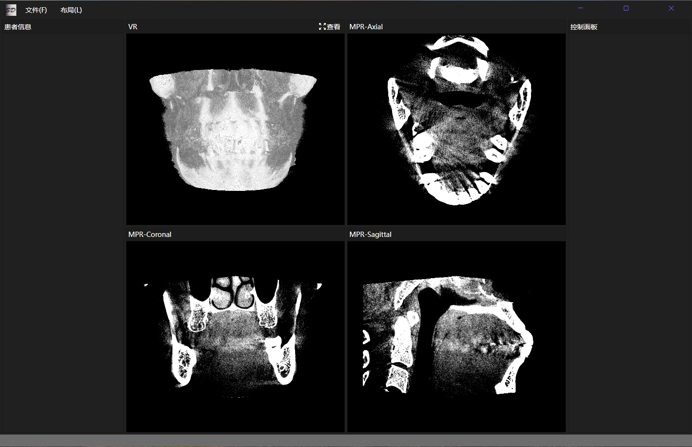

## 框架地址：https://gitee.com/lishilei0523/SD.Framework

#### 项目愿景
> Windows与Linux环境下医学影像查看器；

> 医学影像算法的可视化操作，包含SimpleITK算法库的常用功能；

#### 开发目的：
    1、打造基于OpenGL的医学影像渲染引擎；

    2、探索Avalonia深度应用及其与OpenGL的结合；

    3、封装SimpleITK常用医学影像算法；
    
    4、方便算法开发人员测试调试算法；

#### 主要涉及技术：
    UI部分：OpenGL、Avalonia、FluentAvaloniaUI、Caliburn.Micro等；

    算法部分：SimpleITK；

#### 目标功能模块：
    基础图像浏览：
        体积渲染、MPR渲染、CPR渲染、虚拟内窥镜；

    显示协议：
        窗宽/窗位、传输函数、材质、光照等；
    
    标注与测量：
        2D标注、3D标注、测量；
    
    预处理：
        形态学、滤波、灰度变换、直方图等；
    
    分割：
        阈值分割、ROI分割、区域生长分割等；

    提取：
        边缘检测、轮廓提取、特征提取等；
    
    配准：
        刚体配准、非刚体配准；

    待添加……

## 推荐

> 关联项目，OpenCV工作室：
> [OpenCV Studio](https://gitee.com/lishilei0523/OpenCV-Studio)

> 关联项目，点云工作室：
> [PointCloud Studio](https://gitee.com/lishilei0523/PointCloud-Studio)

> 关联项目，标注工具：
> [LabelSharp](https://gitee.com/lishilei0523/LabelSharp)

## 首页预览

