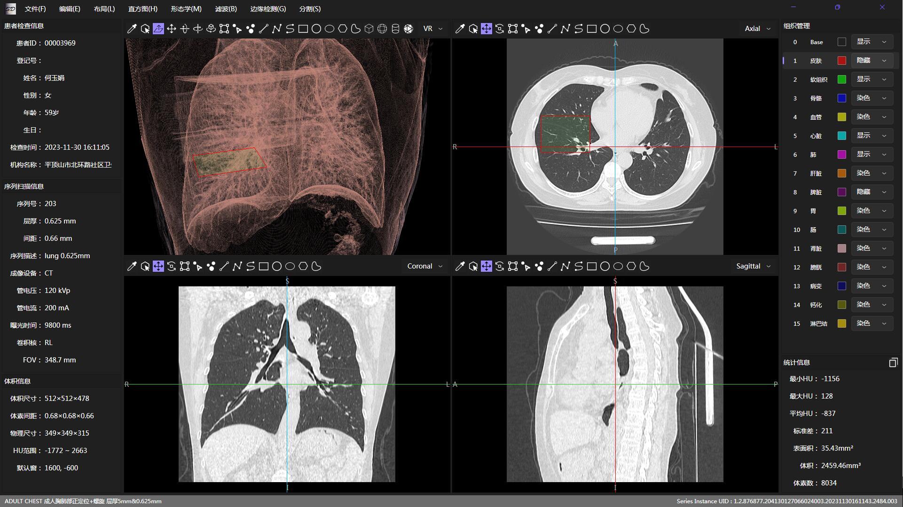

## 框架地址：https://gitee.com/lishilei0523/SD.Framework

#### 项目愿景
> Windows与Linux环境下医学影像查看器；

> 医学影像算法的可视化操作，包含常用预处理、分割、提取、配准等常用算法；

> HelixToolkit式引擎控件；

> CPU/GPU双通道算法处理与数据同步；

#### 开发目的：
    1、打造基于OpenGL的医学影像渲染引擎；

    2、探索Avalonia深度应用及其与OpenGL的结合；

    3、封装OpenCL实现GPU加速算法；

    4、封装SimpleITK常用医学影像算法；

    5、OnnxRuntime部署深度学习算法；
    
    6、方便算法开发人员测试调试算法；

#### 主要涉及技术：
    UI部分：OpenGL、Avalonia、Caliburn.Micro、FluentAvaloniaUI等；

    算法部分：Compute Shader、OpenCL、OpenTK.Mathematics、MIConvexHull、SimpleITK、OnnxRuntime；

#### 目标功能模块：
    基础图像浏览：
        体积渲染、MPR渲染、CPR渲染、虚拟内窥镜；

    显示协议：
        预览模式、渲染模式、窗宽/窗位、传递函数、标记策略、材质等；
    
    标注与染色：
        2D/3D几何体标注、2D/3D几何体染色；

    统计：
        几何体统计、组织统计；
    
    预处理：
        形态学、滤波、边缘检测、灰度变换、直方图等；
    
    分割：
        2D/3D几何体分割、阈值分割、区域生长分割、TotalSegmentor分割等；

    提取：
        轮廓提取、中心线提取、关键点提取、特征提取等；
    
    配准：
        刚体配准、非刚体配准；

    待添加……

## 推荐

> 关联项目，OpenCV工作室：
> [OpenCV Studio](https://gitee.com/lishilei0523/OpenCV-Studio)

> 关联项目，点云工作室：
> [PointCloud Studio](https://gitee.com/lishilei0523/PointCloud-Studio)

> 关联项目，标注工具：
> [LabelSharp](https://gitee.com/lishilei0523/LabelSharp)

## 首页预览

